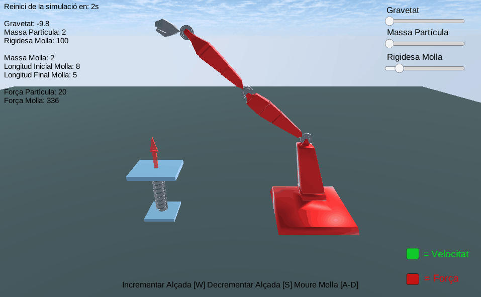

# Inverse Kinematics CCD

Spring simulation movement and force calculations with the help of sin functions and hooke's law and inverse kinematics implemented in the robotic arm with 4 joints simulating the cyclic coordinate descent. 

[Play it here!](https://johnnyginard.itch.io/spring-inverse-kinematics-ccd)

